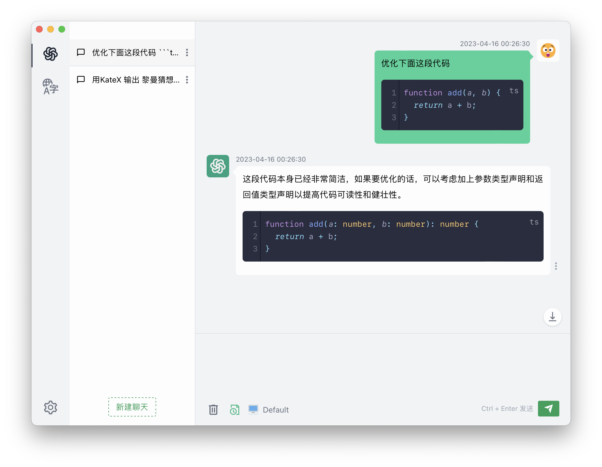

# ChatGPT APP

ChatGPT Desktop Application

ChatGPT 桌面应用




## Explanation 说明

- This project is based on the MIT license and is only for open source communication and learning purposes.
- All data is only saved locally.
- The current desktop application has not yet provided an official installation package.

- 本项目基于 MIT协议，仅作为开源交流学习使用。
- 所有数据均只保存于本地。
- 当前桌面应用还未提供正式的安装包。


## TODO

The basic functions have been implemented.

当前已实现基本功能。

- [x] Chat conversation  聊天对话
- [x] Message format beautification 消息格式美化
- [x] Proxy 代理 http/https/socks
- [x] Multilingual 多语言
- [x] Switch Theme Mode 主题模式切换
- [x] Response error handling 响应错误处理
- [x] 翻译页面
- [ ] Message retry 消息重试
- [ ] more...

## Development

```sh
# Install安装
pnpm i
# Start development 启动开发
pnpm dev
```

### 技术选型

- 构建工具：vite
- vue & vue-router & pinia
- electron
- 数据存储： level
